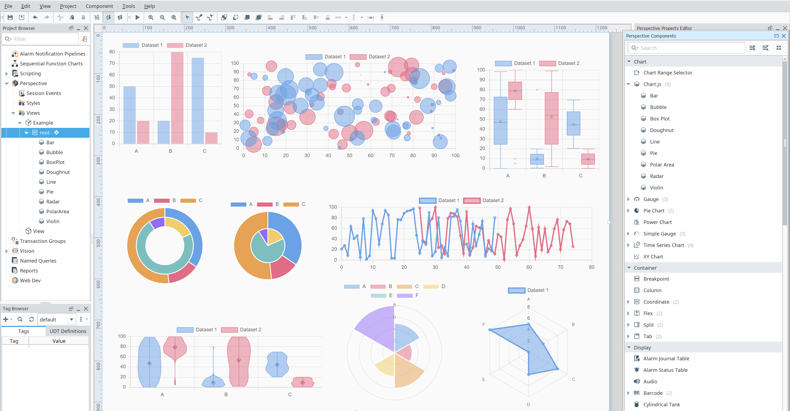

# Embr Charts Module [][embr]

A module for Ignition that adds a collection of enhanced Perspective charting components.

## Getting Started

1. Download the [latest version] from [releases].
2. Install the module through the Ignition Gateway web interface.

### Module Documentation

- [Module documentation] is available at [docs.mussonindustrial.com].

### Component Directory

| Name                                                                                                                   | Category | Description                                                                                                                                                                                                                                                                                       |     |
|------------------------------------------------------------------------------------------------------------------------|----------|---------------------------------------------------------------------------------------------------------------------------------------------------------------------------------------------------------------------------------------------------------------------------------------------------|-----|
| [Chart.js Component](https://docs.mussonindustrial.com/ignition/embr-charts/components/chart-js/)                      | Charting | Chart.js renders chart elements on an HTML5 canvas unlike other D3.js-based charting libraries that render as SVG. Canvas rendering makes Chart.js very performant, especially for large datasets and complex visualizations that would otherwise require thousands of SVG nodes in the DOM tree. |     |
| [ApexCharts Component](https://docs.mussonindustrial.com/ignition/embr-charts/components/apex-charts/)                 | Charting | ApexCharts renders charts using SVG instead of canvas, offering crisp, scalable visuals and seamless CSS styling. While not as fast as canvas for massive datasets, SVG enables rich interactivity, easier DOM manipulation, and high-quality graphics across a wide range of chart types.        |     |
| [ApexCharts (Legacy) Component](https://docs.mussonindustrial.com/ignition/embr-charts/components/apex-charts-legacy/) | Charting | A drop-in replacement for [Kyvis-Labs/ignition-apexcharts-module](https://github.com/Kyvis-Labs/ignition-apexcharts-module).                                                                                                                                                                      |     |

---

## Changelog

The [changelog](./CHANGELOG.md) is regularly updated to reflect what's changed in each new release.

## Sponsors

Maintenance of this project is made possible by all the [contributors] and [sponsors].
If you'd like to sponsor this project and have your avatar or company logo appear below [click here](https://github.com/sponsors/mussonindustrial). 💖

[embr]: https://github.com/mussonindustrial/embr
[releases]: https://github.com/mussonindustrial/embr/releases
[docs.mussonindustrial.com]: https://docs.mussonindustrial.com
[Module documentation]: https://docs.mussonindustrial.com/ignition/embr-charts
[contributors]: https://github.com/JamesIves/github-pages-deploy-action/graphs/contributors
[sponsors]: https://github.com/sponsors/mussonindustrial
[latest version]: https://github.com/mussonindustrial/embr/releases?q=embr-charts&expanded=true
