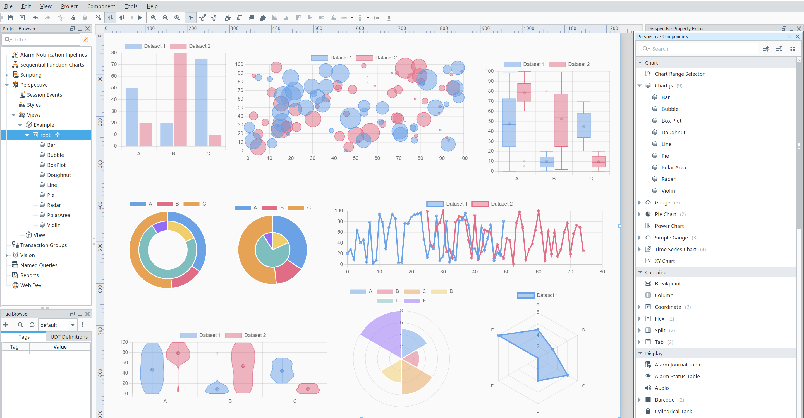

# Embr Charts Module [][embr]

An Ignition module that adds a collection of enhanced Perspective charting components.

## Getting Started
1. Download the [latest version] from [releases].
2. Install the module through the Ignition Gateway web interface.

## Module Documentation
- `#TODO` [Module documentation][documentation]
- [Chart.js documentation][Chart.js documentation]

## [Chart.js] Component



This module provides a [Chart.js] Perspective component.

Chart.js renders chart elements on an HTML5 canvas unlike other D3.js-based charting libraries that render as SVG. 
Canvas rendering makes Chart.js very performant, especially for large datasets and complex visualizations that would otherwise require thousands of SVG nodes in the DOM tree.

### Component Configuration

Details on how to configure the component can be found on the [Chart.js documentation site][Chart.js documentation].
All configurations supported by Chart.js are supported on the Perspective component.

### Plugin Support
The Chart.js community has developed many addons and plugins. A selection of these addons are bundled with the module.

Details on configuring each plugin are outside the scope of this module's documentation. Please consult the plugin's own documentation for complete details.

#### Extra Chart Types
| Name                                                               | Description                                             | Included/Tested |
|--------------------------------------------------------------------|---------------------------------------------------------|-----------------|
| [boxplot](https://github.com/sgratzl/chartjs-chart-boxplot)        | Adds boxplot and violin plot chart type                 | ✅               |
| [funnel](https://github.com/sgratzl/chartjs-chart-funnel)          | Adds funnel chart type                                  | ✅               |
| [graph](https://github.com/sgratzl/chartjs-chart-graph)            | Adds graph chart types such as a force directed graph   | ✅               |
| [matrix](https://github.com/kurkle/chartjs-chart-matrix)           | Adds matrix chart type                                  | ✅               |
| [pcp](https://github.com/sgratzl/chartjs-chart-pcp)                | Adds parallel coordinates plot chart type               | ✅               |
| [sankey](https://github.com/kurkle/chartjs-chart-sankey)           | Adds sankey diagram chart type                          | ✅               |
| [stacked100](https://github.com/y-takey/chartjs-plugin-stacked100) | Draws 100% stacked bar chart                            | ✅               |
| [treemap](https://github.com/kurkle/chartjs-chart-treemap)         | Adds treemap chart type                                 | ✅               |
| [venn](https://github.com/upsetjs/chartjs-chart-venn)              | Adds venn and euler chart type                          | ✅               |
| [word-cloud](https://github.com/sgratzl/chartjs-chart-wordcloud)   | Adds word-cloud chart type                              | ✅               |

#### Plugins

| Name                                                                           | Description                                                                 | Included/Tested |
|--------------------------------------------------------------------------------|-----------------------------------------------------------------------------|-----------------|
| [annotation](https://github.com/chartjs/chartjs-plugin-annotation)             | Draws lines, boxes, points, labels, polygons and ellipses on the chart area | ✅               |
| [autocolors](https://github.com/kurkle/chartjs-plugin-autocolors)              | Automatic color generation                                                  | ✅               |
| [crosshair](https://github.com/abelheinsbroek/chartjs-plugin-crosshair)        | Adds a data crosshair to line and scatter charts                            | ✅               |
| [datalabels](https://github.com/chartjs/chartjs-plugin-datalabels)             | Displays labels on data for any type of charts                              | ✅               |
| [hierarchical](https://github.com/sgratzl/chartjs-plugin-hierarchical)         | Adds hierarchical scales that can be collapsed, expanded, and focused       | ✅               |
| [zoom](https://github.com/chartjs/chartjs-plugin-zoom)                         | Enables zooming and panning on charts                                       | ✅               |

---
### CSS Custom Properties
Any component property value starting with `var(--` will use the corresponding CSS variable's value at render time.

> **_NOTE:_** The property value is only evaluated during the render. Changing the property value will have no effect until the chart is re-rendered.

#### CSS Custom Property Example
```js
// Use var(--my-background-color) custom property
{
  "datasets": [
    {
      "data": [...],
      "label": "Dataset",
      "backgroundColor": "var(--my-background-color)"
    }
  ]
}
```

---
### Scriptable Options
Chart.js scriptable options are supported.

Any component property value containing an arrow function `() =>` statement will be converted into a JavaScript function.
> **_NOTE:_** The converted functions do not support implicit return values. The `return` keyword must be used.

The function will have access to all parameters listed in the [Chart.js documentation].
See [ChartJs Documentation - Scriptable Options](https://www.chartjs.org/docs/latest/general/options.html#scriptable-options) for full details.

#### Global Parameters
In additional to the parameters provided by Chart.js, several Perspective specific global objects can be accessed in scriptable options.
This global objects are implicitly available and do not need to be specified as function arguments.

1. `self` 
      - A reference to the Perspective component props. 
      - Allows access to all properties on the Perspective component (i.e. `self.custom.myCustomProperty`).
2. `client` 
      - A reference to the root Perspective client store. 
      - Allows access to Perspective client properties (i.e. `client.projectName`).


#### Scriptable Option Example
```js
// Conditionally change the background color for a series depending on the y value.
// If the parsed y value is greater than 30 use red; otherwise, use blue.
// For non-data contexts (i.e. the color used for the legend), use green.
{
  "datasets": [
    {
      "data": [...],
      "label": "Dataset",
      "backgroundColor": "(context) => if (context.type == 'data') return context.parsed.y > 30 ? 'red' : 'blue'; else return 'green'; "
    }
  ]
}
```

---
## Changelog
The [changelog](https://github.com/mussonindustrial/embr/blob/main/modules/embr-chart-js/CHANGELOG.md) is regularly updated to reflect what's changed in each new release.


## Sponsors
Maintenance of this project is made possible by all the [contributors] and [sponsors]. 
If you'd like to sponsor this project and have your avatar or company logo appear below [click here](https://github.com/sponsors/mussonindustrial). 💖


[embr]: https://github.com/mussonindustrial/embr
[releases]: https://github.com/mussonindustrial/embr/releases
[documentation]: https://docs.mussonindustrial.com/
[contributors]: https://github.com/JamesIves/github-pages-deploy-action/graphs/contributors
[sponsors]: https://github.com/sponsors/mussonindustrial
[latest version]: https://github.com/mussonindustrial/embr/releases?q=embr-charts&expanded=true
[Chart.js]: https://www.chartjs.org/
[Chart.js documentation]: https://www.chartjs.org/docs/latest/
[Chart.js Addons]: https://github.com/chartjs/awesome


