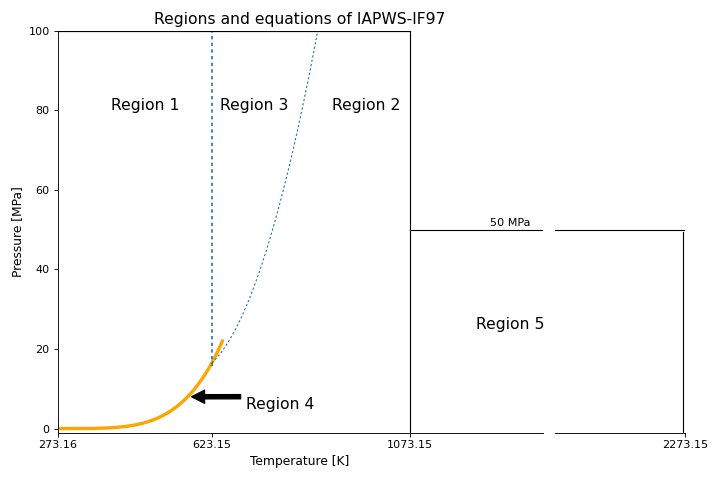

# Embr Thermodynamics Module [][embr]

An Ignition module containing scripting and expression functions for computing properties of steam via an IF97 implementation.

## Getting Started
1. Download the latest version from [releases].
2. Install the module through the Ignition Gateway web interface.

## Module Documentation
- `#TODO` [Module documentation][documentation]

---

## IAPWS-IF97
IAPWS (_The International Association for the Properties of Water and Steam_) is an international non-profit association of national organizations concerned with the properties of water and steam, particularly thermophysical properties, cycle chemistry guidelines, and other aspects of high-temperature steam, water and aqueous mixtures relevant to thermal power cycles and other industrial and scientific applications.

This formulation ([IAPWS-IF97]) is recommended for industrial use (primarily the steam power industry) for the calculation of thermodynamic properties of ordinary water in its fluid phases, including vapor-liquid equilibrium.
The formulation is a close approximation to the [IAPWS-IF95] formulation for general and scientific use, but is designed for much greater computational speed. 

The range of validity is divided into several regions (with close tolerances for consistency at region boundaries), each of which is represented by a different fundamental equation. 
Appropriate combinations of derivatives from this equation can produce any thermodynamic property desired (density or specific volume, sound speed, heat capacity, enthalpy, entropy, etc.).
The formulation is valid from 273.15 K to 1073.15 K at pressures to 100 MPa, and there is a high-temperature region extending to 2273.15 K at pressures to 50 MPa. 
There is also a separate equation for metastable steam at pressures up to 10 MPa.

### Valid Regions



### Supported Properties and Parameters 
| Property                                   | Symbol | SI          | (p, T) | (p, h) | (p, s) | (h, s) | (T, s) | (ρ, T) | (p, x) | (T, x) |
|--------------------------------------------|--------|-------------|--------|--------|--------|--------|--------|--------|--------|--------|
| Absolute pressure                          | p      | Pa          |        |        |        | ✓      |        |        | ✓      | ✓ sat. |
| Density                                    | ρ      | kg/m³       | ✓      | ✓      | ✓      | ✓      |        |        | ✓      | ✓      |
| Dielectric constant                        | ε      | -           | ✓      | ✓      | ✓      | ✓      |        | ✓      |        |        |
| Dynamic viscosity                          | η      | Pa·s        | ✓      | ✓      | ✓      | ✓      |        | ✓      |        |        |
| Isobaric cubic expansion coefficient       | αv     | 1/K         | ✓      | ✓      | ✓      | ✓      |        |        |        |        |
| Isothermal compressibility                 | κT     | 1/Pa        | ✓      | ✓      | ✓      | ✓      |        |        |        |        |
| Kinematic viscosity                        | ν      | m²/s        | ✓      | ✓      | ✓      | ✓      |        | ✓      |        |        |
| Prandtl number                             | Pr     | -           | ✓      | ✓      | ✓      | ✓      |        |        |        |        |
| Refractive index                           | n      | -           | ✓      | ✓      | ✓      | ✓      |        | ✓      |        |        |
| Specific enthalpy                          | h      | J/kg        | ✓      |        | ✓      |        |        |        | ✓      | ✓      |
| Specific entropy                           | s      | J/(kg·K)    | ✓      | ✓      |        |        |        |        | ✓      | ✓      |
| Specific Gibbs free energy                 | g      | J/kg        | ✓      |        |        |        |        |        |        |        |
| Specific internal energy                   | u      | J/kg        | ✓      | ✓      | ✓      | ✓      |        |        |        |        |
| Specific isobaric heat capacity            | cp     | J/(kg·K)    | ✓      | ✓      | ✓      | ✓      |        |        |        |        |
| Specific isochoric heat capacity           | cv     | J/(kg·K)    | ✓      | ✓      | ✓      | ✓      |        |        |        |        |
| Specific volume                            | v      | m³/kg       | ✓      | ✓      | ✓      | ✓      |        |        | ✓      | ✓      |
| Speed of sound                             | w      | m/s         | ✓      | ✓      | ✓      | ✓      |        |        |        |        |
| Surface tension                            | σ      | N/m         |        |        |        |        |        |        | ✓      | ✓      |
| Temperature                                | T      | K           |        | ✓      | ✓      | ✓      |        |        | ✓ sat. |        |
| Thermal conductivity                       | λ      | W/(m·K)     | ✓      | ✓      | ✓      | ✓      |        | ✓      |        |        |
| Thermal diffusivity                        | κ      | m²/s        | ✓      | ✓      | ✓      | ✓      |        |        |        |        |
| Vapour fraction                            | x      | -           |        | ✓      | ✓      | ✓      | ✓      |        |        |        |
| Wavelength of light                        | λL     | m           |        |        |        |        |        |        |        |        |

### Scripting Functions

The following scripting functions are available in all Ignition scopes.

Each scripting function has a variety of overloads to match the [Table of Supported Properties](#supported-properties-and-parameters).
The designer scripting hints also list the accepted parameters sets.


```python
system.thermo.if97.compressibility(h, p, s, t)
system.thermo.if97.compressionFactor(p, t)
system.thermo.if97.density(h, p, s, t, x)
system.thermo.if97.dielectricConstant(h, p, rho, s, t)
system.thermo.if97.heatCapacityRatio(h, p, s, t)
system.thermo.if97.isentropicExponent(h, p, s, t)
system.thermo.if97.isobaricCubicExpansionCoefficient(h, p, s, t, x)
system.thermo.if97.isobaricHeatCapacity(h, p, s, t)
system.thermo.if97.isochoricHeatCapacity(h, p, s, t)
system.thermo.if97.kinematicViscosity(h, p, rho, s, t)
system.thermo.if97.prandtl(h, p, s, t)
system.thermo.if97.pressure(h, s)
system.thermo.if97.refractiveIndex(h, l, p, rho, s, t)
system.thermo.if97.saturationPressure(h, s, t)
system.thermo.if97.saturationTemperature(h, p, s)
system.thermo.if97.specificEnthalpy(p, s, t, x)
system.thermo.if97.specificEnthalpySaturatedLiquid(p, t)
system.thermo.if97.specificEnthalpySaturatedVapor(p, t)
system.thermo.if97.specificEntropy(h, p, t, x)
system.thermo.if97.specificEntropySaturatedLiquid(p, t)
system.thermo.if97.specificEntropySaturatedVapor(p, t)
system.thermo.if97.specificGibbsFreeEnergy(p, t)
system.thermo.if97.specificInternalEnergy(h, p, s, t, x)
system.thermo.if97.specificInternalEnergySaturatedLiquid(p, t)
system.thermo.if97.specificInternalEnergySaturatedVapor(p, t)
system.thermo.if97.specificVolume(h, p, s, t, x)
system.thermo.if97.specificVolumeSaturatedLiquid(p, t)
system.thermo.if97.specificVolumeSaturatedVapor(p, t)
system.thermo.if97.speedOfSound(h, p, s, t)
system.thermo.if97.vaporFraction(h, p, s, t)
```

### Expression Functions
Because expression functions do not support operator overloading (and adding functions to cover all possibilities of parameters is impractical), this module provides a single expression function for accessing all `if97` properties.

`property` is case-insensitive and parameters can be specified in any order.

```python
// Usage
if97(property, [[parameter], [value]...])
    
// Examples
if97("specificEntropy", "p", 200000, "t", 400)
if97("saturationPressure", "t", 500)
if97("vaporFraction", "p", 110000, "t", 1150000)
```

---
## Changelog

The [changelog](https://github.com/mussonindustrial/embr/blob/main/modules/thermo/CHANGELOG.md) is regularly updated to reflect what's changed in each new release.

## Copyright and Licensing

Copyright (C) 2024 Musson Industrial

Free use of this software is granted under the terms of the MIT License.

[embr]: https://github.com/mussonindustrial/embr
[releases]: https://github.com/mussonindustrial/embr/releases
[documentation]: https://docs.mussonindustrial.com/
[IAPWS-IF97]: http://www.iapws.org/relguide/IF97-Rev.html
[IAPWS-IF95]: http://www.iapws.org/relguide/IAPWS-95.html